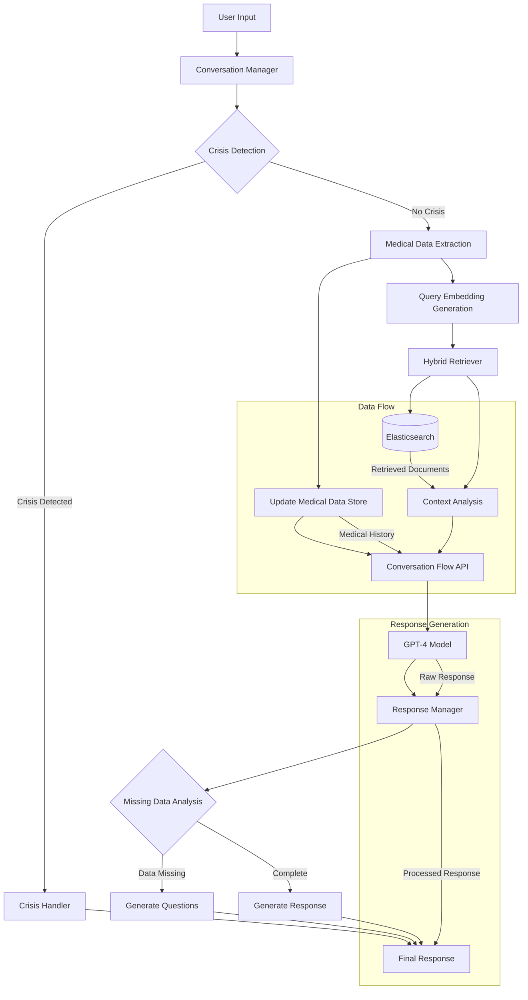

# RAG Depression Chatbot

A Retrieval Augmented Generation (RAG) based chatbot that provides information and support related to depression using verified medical sources.

## System Architecture



## Project Structure

```
.
├── data/
│   ├── raw/         # Original source documents (PDFs, texts)
│   └── processed/   # Processed and indexed documents
├── docs/            # Detailed documentation
├── examples/        # Example usage and demos
├── src/            # Source code
│   ├── api/        # FastAPI backend
│   ├── conversation/  # Conversation management
│   ├── data_pipeline/ # Data processing pipeline
│   ├── embeddings/    # Embedding generation and management
│   ├── retrieval/     # Document retrieval logic
│   └── storage/       # Database and storage management
└── tests/          # Test suite
    ├── unit/       # Unit tests
    └── integration/ # Integration tests
```

## Setup

1. Clone the repository:
```bash
git clone <repository-url>
cd rag-depression-chatbot
```

2. Install dependencies using Poetry:
```bash
poetry install
```

3. Set up environment variables:
```bash
cp .env.example .env
# Edit .env with your configuration
```

4. Process and index documents:
```bash
poetry run python -m src.data_pipeline.index_documents
```

5. Run the application:
```bash
poetry run streamlit run src.streamlit_app.py
```

## Features

- Hybrid retrieval system combining semantic search and keyword matching
- Conversation memory and context management
- Integration with verified medical sources
- User-friendly Streamlit interface
- Elasticsearch-based document storage

## Development

### Running Tests
```bash
poetry run pytest
```

### Code Style
The project uses:
- Black for code formatting
- isort for import sorting
- flake8 for linting

Format code before committing:
```bash
poetry run black .
poetry run isort .
poetry run flake8
```

## Documentation

Detailed documentation is available in the `/docs` directory:
- [API Documentation](docs/api.md)
- [Data Pipeline](docs/data-pipeline.md)
- [Retrieval System](docs/retrieval.md)
- [Deployment Guide](docs/deployment.md)

## License

[Your chosen license]
